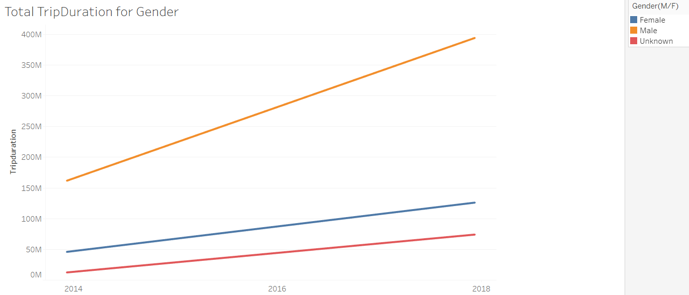

# Tableau--Challenge

## Background

Data was selected from 2014 and 2018 for bike riders based on gender, age, trip duration, etc. The conclusions drawn from the data are displayed as visuals in a dashboard using Tableau, which compares how men and women differ in their NYC Citibike usage, and what areas of New York have the most bike riders.

## Technologies

Excel and Tableau

## Data Source

The data source used for this analysis is: https://s3.amazonaws.com/tripdata/index.html

A CSV file containing the data used can be found in the data folder.

## Trip Duration For Gender

## Dashboard

.PNG)
.PNG)

## Conclusion

Trip durations for the top of the year in 2014 (January) was around 220.48M seconds and trips in 2018 (January) were about 594.57M seconds. This is about a 170% increase over a four year span, which could be due to either an increase of bike riders, increase of trip length, or both. A further analysis was conducted to see which gender (Male/Female) made up the total trip durations. According to the findings, male bike riders made up about 73% of the total trip durations in 2014 and 66% in 2018, while females made up about 21% of the total durations in 2014 and 21% in 2018. What can be inferred from the analysis is that male bikers' trip length decreased overall, but males still biked longer distances than females. A map displaying the station locations has been generated. The darker the shade of blue and the larger the bubble means those stations have the most riders. Some of the popular stations are located around Union Square and the New York Penn Station. Overall, what can be deduced from the analysis is that males ride bikes more often and longer distances than women in New York, especially given this four year period. 
